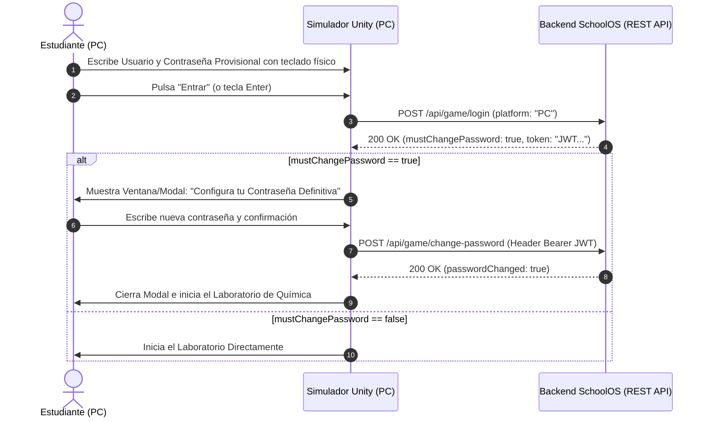

# 🖥️ Guía de Integración Unity: Primer Inicio de Sesión y Cambio de Contraseña (Edición PC)

Este documento contiene la especificación técnica, contratos JSON y el script en C# para implementar el **cambio obligatorio de contraseña** en el primer inicio de sesión del estudiante, enfocado **exclusivamente en la versión de PC (Windows Standalone)**.

---

## 📌 1. Flujo del Sistema en PC



---

## 📡 2. Endpoints de la API

### 2.1. `POST /api/game/login`

Autentica al estudiante con su usuario institucional y contraseña temporal.

- **URL:** `https://labdequimica.site/api/game/login` (o `http://localhost:4321/api/game/login` en desarrollo local)
- **Headers:** `Content-Type: application/json`
- **Request Body (PC):**
```json
{
  "identifier": "testeo3@raptorcrew.edu.co",
  "password": "MiPasswordTemporal123!",
  "platform": "PC"
}
```

#### Respuesta si es su Primer Inicio (`mustChangePassword: true`):
```json
{
  "ok": true,
  "token": "eyJhbGciOiJIUzI1NiIsInR5cCI6IkpXVCJ9...",
  "mustChangePassword": true,
  "passwordResetRequired": true,
  "student": {
    "id": "30af61c1-93d5-4d67-adda-2995b406ae2e",
    "name": "testeo3",
    "email": "testeo3@raptorcrew.edu.co",
    "documentId": "EST-2026-9041",
    "schoolId": "eaf69854-c848-4ea7-8ea9-ff7f8587f702"
  },
  "hasActiveLab": true,
  "activeLab": {
    "tokenId": "4975d824-2a2c-41fc-aa72-788aacec8a3a",
    "labId": "180e8836-56d1-43ac-8175-7c754a922c3c",
    "labName": "Separación de agua y aceite (Laboratorio de Química)",
    "courseName": "Química General"
  },
  "message": "Primer inicio de sesión detectado: debes asignar tu contraseña definitiva para continuar."
}
```

---

### 2.2. `POST /api/game/change-password`

Permite a Unity actualizar la contraseña definitiva del estudiante.

- **URL:** `https://labdequimica.site/api/game/change-password`
- **Headers:**
  - `Content-Type: application/json`
  - `Authorization: Bearer <TOKEN_RECIBIDO_EN_LOGIN>`
- **Request Body:**
```json
{
  "newPassword": "MiPasswordDefinitiva2026!*"
}
```

> [!NOTE]
> **Requisitos:** La nueva contraseña debe tener mínimo 8 caracteres.

#### Respuesta Exitosa (200 OK):
```json
{
  "ok": true,
  "passwordChanged": true,
  "message": "¡Contraseña actualizada con éxito! Ahora puedes iniciar tus prácticas en el simulador."
}
```

---

## 💻 3. Script C# para Unity (Exclusivo PC)

Guarda este script como `GameAuthManagerPC.cs` en tu carpeta `Assets/Scripts/`:

```csharp
using System;
using System.Collections;
using System.Text;
using UnityEngine;
using UnityEngine.Networking;
using UnityEngine.UI;

[System.Serializable]
public class LoginRequestPC {
    public string identifier;
    public string password;
    public string platform = "PC";
}

[System.Serializable]
public class ChangePasswordRequestPC {
    public string newPassword;
}

[System.Serializable]
public class StudentInfoPC {
    public string id;
    public string name;
    public string email;
    public string documentId;
}

[System.Serializable]
public class LoginResponsePC {
    public bool ok;
    public string token;
    public bool mustChangePassword; // <-- BANDERA CLAVE
    public string message;
    public StudentInfoPC student;
    public string error;
}

[System.Serializable]
public class SimpleResponsePC {
    public bool ok;
    public bool passwordChanged;
    public string message;
    public string error;
}

public class GameAuthManagerPC : MonoBehaviour {
    [Header("Configuración del Servidor")]
    [Tooltip("Usa http://localhost:4321 para pruebas locales o https://labdequimica.site para producción")]
    [SerializeField] private string apiBaseUrl = "https://labdequimica.site";

    [Header("UI - Formulario de Login (PC)")]
    [SerializeField] private InputField inputUsuario;
    [SerializeField] private InputField inputPassword;
    [SerializeField] private Button btnEntrar;
    [SerializeField] private Text txtMensajeError;

    [Header("UI - Ventana Cambio de Contraseña (Modal)")]
    [SerializeField] private GameObject panelCambioPassword;
    [SerializeField] private InputField inputNuevaPassword;
    [SerializeField] private InputField inputConfirmarPassword;
    [SerializeField] private Button btnGuardarPassword;
    [SerializeField] private Text txtErrorModal;

    [Header("Escena del Laboratorio")]
    [SerializeField] private string nombreEscenaLaboratorio = "LaboratorioQuimica";

    private string currentSessionToken = "";

    private void Start() {
        if (panelCambioPassword != null) panelCambioPassword.SetActive(false);

        if (btnEntrar != null) btnEntrar.onClick.AddListener(OnLoginClicked);
        if (btnGuardarPassword != null) btnGuardarPassword.onClick.AddListener(OnChangePasswordClicked);

        // Soporte de tecla ENTER para enviar login rápidamente en PC
        if (inputPassword != null) {
            inputPassword.onEndEdit.AddListener(val => {
                if (Input.GetKeyDown(KeyCode.Return) || Input.GetKeyDown(KeyCode.KeypadEnter)) {
                    OnLoginClicked();
                }
            });
        }
    }

    public void OnLoginClicked() {
        string user = inputUsuario != null ? inputUsuario.text.Trim() : "";
        string pass = inputPassword != null ? inputPassword.text.Trim() : "";

        if (string.IsNullOrEmpty(user) || string.IsNullOrEmpty(pass)) {
            MostrarError("Por favor ingresa tu usuario y contraseña institucional.");
            return;
        }

        StartCoroutine(ExecuteLogin(user, pass));
    }

    private IEnumerator ExecuteLogin(string user, string pass) {
        if (btnEntrar != null) btnEntrar.interactable = false;
        MostrarError("Conectando con el servidor...");

        LoginRequestPC req = new LoginRequestPC {
            identifier = user,
            password = pass,
            platform = "PC"
        };

        string jsonBody = JsonUtility.ToJson(req);
        using (UnityWebRequest www = new UnityWebRequest(apiBaseUrl + "/api/game/login", "POST")) {
            byte[] bodyRaw = Encoding.UTF8.GetBytes(jsonBody);
            www.uploadHandler = new UploadHandlerRaw(bodyRaw);
            www.downloadHandler = new DownloadHandlerBuffer();
            www.SetRequestHeader("Content-Type", "application/json");

            yield return www.SendWebRequest();

            if (btnEntrar != null) btnEntrar.interactable = true;

            if (www.result == UnityWebRequest.Result.Success) {
                LoginResponsePC res = JsonUtility.FromJson<LoginResponsePC>(www.downloadHandler.text);
                if (res != null && res.ok) {
                    currentSessionToken = res.token;
                    MostrarError("");

                    // EVALUACIÓN DE PRIMER INGRESO
                    if (res.mustChangePassword) {
                        Debug.Log("[PC] Primer inicio de sesión. Abriendo modal de cambio de contraseña.");
                        AbrirModalCambioPassword();
                    } else {
                        Debug.Log("[PC] Login exitoso. Iniciando laboratorio...");
                        IniciarLaboratorio();
                    }
                } else {
                    MostrarError(res?.error ?? "Error al autenticar usuario.");
                }
            } else {
                MostrarError("Credenciales inválidas o error de conexión con el servidor.");
            }
        }
    }

    private void AbrirModalCambioPassword() {
        if (panelCambioPassword != null) {
            panelCambioPassword.SetActive(true);
            if (txtErrorModal != null) txtErrorModal.text = "";
            if (inputNuevaPassword != null) {
                inputNuevaPassword.text = "";
                inputNuevaPassword.Select();
                inputNuevaPassword.ActivateInputField();
            }
            if (inputConfirmarPassword != null) inputConfirmarPassword.text = "";
        }
    }

    public void OnChangePasswordClicked() {
        string p1 = inputNuevaPassword != null ? inputNuevaPassword.text.Trim() : "";
        string p2 = inputConfirmarPassword != null ? inputConfirmarPassword.text.Trim() : "";

        if (p1.Length < 8) {
            MostrarErrorModal("La contraseña debe tener mínimo 8 caracteres.");
            return;
        }

        if (p1 != p2) {
            MostrarErrorModal("Las contraseñas no coinciden. Verifícalas.");
            return;
        }

        StartCoroutine(ExecuteChangePassword(p1));
    }

    private IEnumerator ExecuteChangePassword(string nuevaPassword) {
        if (btnGuardarPassword != null) btnGuardarPassword.interactable = false;
        MostrarErrorModal("Guardando contraseña definitiva en el servidor...");

        ChangePasswordRequestPC req = new ChangePasswordRequestPC { newPassword = nuevaPassword };
        string jsonBody = JsonUtility.ToJson(req);

        using (UnityWebRequest www = new UnityWebRequest(apiBaseUrl + "/api/game/change-password", "POST")) {
            byte[] bodyRaw = Encoding.UTF8.GetBytes(jsonBody);
            www.uploadHandler = new UploadHandlerRaw(bodyRaw);
            www.downloadHandler = new DownloadHandlerBuffer();
            www.SetRequestHeader("Content-Type", "application/json");
            www.SetRequestHeader("Authorization", "Bearer " + currentSessionToken);

            yield return www.SendWebRequest();

            if (btnGuardarPassword != null) btnGuardarPassword.interactable = true;

            if (www.result == UnityWebRequest.Result.Success) {
                SimpleResponsePC res = JsonUtility.FromJson<SimpleResponsePC>(www.downloadHandler.text);
                if (res != null && res.ok) {
                    Debug.Log("[PC] ¡Contraseña cambiada con éxito! Ingresando a la simulación.");
                    if (panelCambioPassword != null) panelCambioPassword.SetActive(false);
                    IniciarLaboratorio();
                } else {
                    MostrarErrorModal(res?.error ?? "No se pudo actualizar la contraseña.");
                }
            } else {
                MostrarErrorModal("Error de red al actualizar la contraseña.");
            }
        }
    }

    private void IniciarLaboratorio() {
        Debug.Log("[PC] Cargando escena: " + nombreEscenaLaboratorio);
        // UnityEngine.SceneManagement.SceneManager.LoadScene(nombreEscenaLaboratorio);
    }

    private void MostrarError(string msg) {
        if (txtMensajeError != null) txtMensajeError.text = msg;
    }

    private void MostrarErrorModal(string msg) {
        if (txtErrorModal != null) txtErrorModal.text = msg;
    }
}
```

---

## 🛠️ 4. Pasos Rápidos en el Editor de Unity (PC)

1. Crea un **Canvas** en tu escena de inicio con:
   - Panel de Login: `InputField` Usuario, `InputField` Contraseña (`ContentType: Password`), Botón `Entrar` y `Text` de Error.
   - Panel Modal de Cambio de Clave (inicialmente desactivado `SetActive(false)`):
     - `InputField` Nueva Contraseña (`ContentType: Password`).
     - `InputField` Confirmar Contraseña (`ContentType: Password`).
     - Botón `Guardar y Comenzar`.
     - `Text` para mensajes de error.
2. Agrega el script `GameAuthManagerPC.cs` a un GameObject vacío (por ejemplo `[AuthManager]`).
3. Arrastra los elementos del Canvas a los campos correspondientes en el Inspector.
4. ¡Listo! Al probar con un usuario en su primer ingreso, el modal se abrirá automáticamente y al guardar continuará sin problemas.
